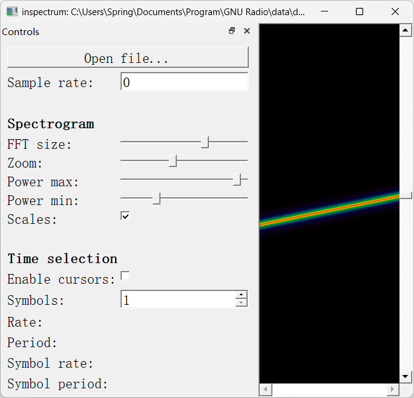
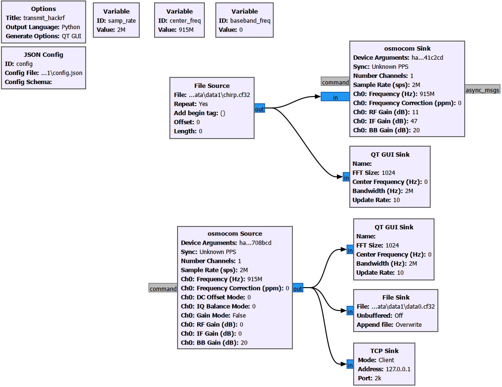
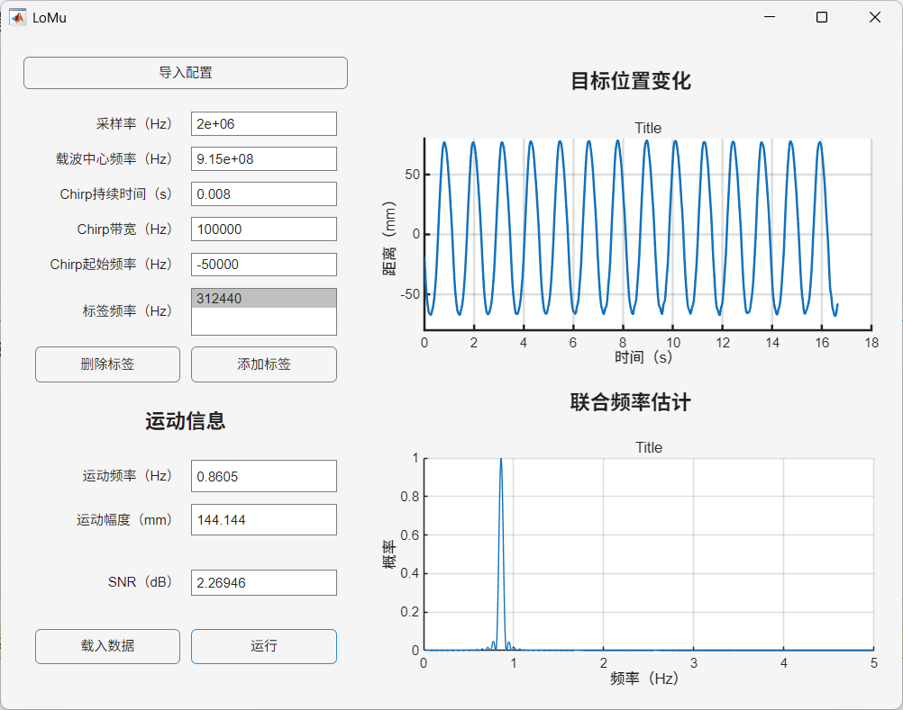

# LoMu

论文链接：

- [TMC版本](https://doi.org/10.1109/TMC.2024.3480137)
- [INFOCOM版本](https://doi.org/10.1109/INFOCOM52122.2024.10621272)

这个仓库是论文对应的代码，应该可以直接跑的。

总共有三个文件夹：

- matlab：信号处理与用户界面实现
- gnu：信号发送与接收
- data：保存信号文件

## 配置文件

贯穿全程的文件是 `config.json` 配置文件，请参考以下说明。

```json
// config.json

{
    "fs": 1e6,  // 采样率，保证信号接收与信号处理时采样率一致
    "center_freq": 433e6,  // 载波频率，保证信号发送与信号接收时载波频率一致
    "type": "chirp",  // 信号类型，保证信号发送与信号处理时类型一致（曾经还支持 single-tone，不过现在只支持 chirp）
    "T": 32.768e-3,  // 一个 chirp 符号的长度，保证信号发送与信号处理时参数一致
    "BW": 125e3,  // 一个 chirp 符号的带宽，保证信号发送与信号处理时参数一致
    "tag": [
        281770  // tag 的频移频率，信号处理时使用
    ]
}
```

> 请记住，JSON格式是没有注释的。

## 信号文件

信号文件是 `Complex Float32` 类型的二进制文件，信号收发和处理都基于该类型的文件，可以用 Inspectrum 文件打开。



## 信号收发

可以直接用商用 LoRa 节点或者 SDR 发送，要求信号类型为持续不断的 up-chirp。

可以直接用 SDR 接收，要求收发端载波频率一致。



这是一个 HackRF One 信号收发的流图，发送的信号是 `config.json` 定义的信号文件，这个信号文件在运行任意处理程序时都会在 `config.json` 所在的目录下生成。接收的信号会输出至文件中以供离线处理，或者由网络传输至特定地址。

> 注意流图中信号的数据类型都是 `Complex Float32`。

## 信号处理

`matlab` 文件夹下有一个环境配置文件，将 `.env.example` 重命名为 `.env`，然后输入信号文件所在的目录，务必保证该目录下有信号文件对应的配置文件 `config.json`。

运行 `process_data_offline` 进行离线处理，能看到使用/不使用滤波器时得到的信号相位、幅度和联合估计算法的结果。

运行 `process_data_online` 进行在线处理，能看到实时的信号相位和估算的频率。

> 使用在线功能需要同时修改脚本中监听的端口和GNU流图中发送到的端口一致。

运行 `process_data_file` 进行文件处理，实质是回放信号进行精处理并导出高帧率视频。

> 以上三个文件处理脚本可以设置处理哪些标签，关注 `tag` 数组。

运行 `sense.mlapp` 将打开一个图形用户界面，通过图形操作导入配置、信号并进行处理与结果显示。



> SNR 看个乐呵就行了。